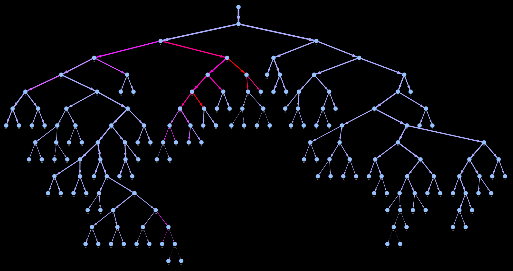

## CLI Commands

### ▶️ `eval-graph` group to analyze individual patient graphs

| **Description** | Group to chain together loading a graph with downstream tasks (e.g. scoring, visualization)                                                                                                                                                                                                                                         |
| --------------- | ----------------------------------------------------------------------------------------------------------------------------------------------------------------------------------------------------------------------------------------------------------------------------------------------------------------------------------- |
| **Usage**       | `eval-graph [OPTIONS] INPUT_FILE COMMAND1 [ARGS]... [COMMAND2 [ARGS]...]...`                                                                                                                                                                                                                                                        |
| **Help**        | `eval-graph --help`: Show help message and exit.                                                                                                                                                                                                                                                                                    |
| **Arguments**   | `INPUT_FILE`: Path to JSON graph, or patient ID (e.g. `0055`).                                                                                                                                                                                                                                                                      |
| **Options**     | `-g, --graphs-dir DIRECTORY`: Directory(ies) to search for graph files.  `-p, --pattern TEXT`: Glob pattern to search for files within `graphs-dir` (e.g. '\*{id}\_enriched_graph.json').  `-l, --legacy-networkx-format`: Use legacy attribute names to parse NetworkX-internal graph data (i.e. 'links' instead of 'edges') |
| **Commands**    | `mastora`: Compute Mastora score on the graph.  `qanadli`: Compute Qanadli score on the graph. `visualize`: Visualize attribute values in the graph an interactive PyVis-generated HTML.                                                                                                                                      |
| **Examples**    | `eval-graph -g data/PERSEVERE/graphs -p '*{id}*.json' -l 0055`                                                                                                                                                                                                                                                                      |

&#160;

### ▶️ `eval-population` command to analyse the distribution of clinical attributes and/or scores across multiple patients

| **Description** | Group to chain together loading clinical data and graphs for a whole population with downstream tasks (e.g. scoring, plotting)                                                                                                                                                                                                                                                                                                         |
| --------------- | -------------------------------------------------------------------------------------------------------------------------------------------------------------------------------------------------------------------------------------------------------------------------------------------------------------------------------------------------------------------------------------------------------------------------------------- |
| **Usage**       | `eval-population [OPTIONS] COMMAND1 [ARGS]... [COMMAND2 [ARGS]...]...`                                                                                                                                                                                                                                                                                                                                                                 |
| **Help**        | `eval-population --help`: Show help message and exit.                                                                                                                                                                                                                                                                                                                                                                                  |
| **Options**     | `-c, --clinical-data FILE`: Path to a CSV file of clinical data to pair with patients' graphs.  `-g, --graphs-dir DIRECTORY`: Directory(ies) to search for graph files.  `-p, --pattern TEXT`: Glob pattern to search for files within `graphs-dir` (e.g. '\*{id}\_enriched_graph.json').  `-l, --legacy-networkx-format`: Use legacy attribute names to parse NetworkX-internal graph data (i.e. 'links' instead of 'edges') |
| **Examples**    | Load graphs and clinical data of patients listed in a CSV: `eval-population -c data/PERSEVERE/clinical_data.csv -g data/PERSEVERE/graphs -p '*{id}*.json' -l`                                                                                                                                                                                                                                                                          |

#### ▶ `plot` subcommand to plot distributions of clinical attributes and/or scores across the population

| **Description** | Plot distribution of attribute(s) with respect to other attribute(s).                                                                                                                                                                                                                                                                                                                                                                                                                                                                    |
| --------------- | ---------------------------------------------------------------------------------------------------------------------------------------------------------------------------------------------------------------------------------------------------------------------------------------------------------------------------------------------------------------------------------------------------------------------------------------------------------------------------------------------------------------------------------------- |
| **Usage**       | `eval-population plot [OPTIONS]`                                                                                                                                                                                                                                                                                                                                                                                                                                                                                                         |
| **Help**        | `eval-population plot --help`: Show help message and exit.                                                                                                                                                                                                                                                                                                                                                                                                                                                                               |
| **Scores**      | For how to precompute scores before plotting them, see the sections below on the [`qanadli` command](#-qanadli) or [`mastora` command](#-mastora).                                                                                                                                                                                                                                                                                                                                                                                       |
| **Options**     | `-r, --row TEXT`: Attribute(s) to plot along the rows of the figure.  `-c, --col TEXT`: Attribute(s) to plot along the columns of the figure.  `--categorical-plot {violin\|histogram}`: Type of plot to use for categorical attributes.                                                                                                                                                                                                                                                                                           |
| **Examples**    | Plot distribution of Qanadli and Mastora (global) score with respect to risk stratification:  `eval-population -c data/PERSEVERE/clinical_data.csv -g data/PERSEVERE/graphs -p '*{id}*.json' -l qanadli mastora global plot -r qanadli -r mastora_global -c risk --categorical-plot violin`  Plot distribution of Mastora (central) score with respect to age and BNP:  `eval-population -c data/PERSEVERE/clinical_data.csv -g data/PERSEVERE/graphs -p '*{id}*.json' -l mastora central plot -r mastora_global -c age -c bnp` |

&#160;

### Chainable subcommands

#### ▶ `qanadli`

Details of how the Qanadli score is computed are provided [here](scores/formulas.md#qanadli-score).

| **Description** | Command to compute the Qanadli obstruction score on the graph(s)                                                                                                                                                                                                                                                                  |
| --------------- | --------------------------------------------------------------------------------------------------------------------------------------------------------------------------------------------------------------------------------------------------------------------------------------------------------------------------------- |
| **Usage**       | `GROUP_COMMAND qanadli [OPTIONS]`                                                                                                                                                                                                                                                                                                 |
| **Input**       | For how to specify input, see the sections above on the [`eval-graph` command](#-eval-graph) or [`eval-population` command](#-eval-population).                                                                                                                                                                                   |
| **Help**        | `GROUP_COMMAND qanadli --help`: Show help message and exit.                                                                                                                                                                                                                                                                       |
| **Options**     | `-o, --obstruction-attr TEXT`: Edge attribute to use as obstruction values.  `-po, --partial-obstruction-thresh FLOAT`: Transversal obstruction threshold to consider a segment partially obstructed.  `-to, --total-obstruction-thresh FLOAT`: Transversal obstruction threshold to consider a segment totally obstructed. |
| **Examples**    | Compute Qanadli score for one patient: `eval-graph -g data/PERSEVERE/graphs -p '*{id}*.json' -l 0055 qanadli`  Compute Qanadli score for a whole population: `eval-population -c data/PERSEVERE/clinical_data.csv -g data/PERSEVERE/graphs -p '*{id}*.json' -l qanadli`                                                        |

#### ▶️ `mastora`

Details of how the Qanadli score is computed are provided [here](scores/formulas.md#mastora-score).

| **Description** | Command to compute the Mastora obstruction score on the graph(s)                                                                                                                                                                                                                                                     |
| --------------- | -------------------------------------------------------------------------------------------------------------------------------------------------------------------------------------------------------------------------------------------------------------------------------------------------------------------- |
| **Usage**       | `GROUP_COMMAND mastora [OPTIONS]`                                                                                                                                                                                                                                                                                    |
| **Input**       | For how to specify input, see the sections above on the [`eval-graph` command](#-eval-graph) or [`eval-population` command](#-eval-population).                                                                                                                                                                      |
| **Help**        | `GROUP_COMMAND mastora --help`: Show help message and exit.                                                                                                                                                                                                                                                          |
| **Arguments**   | `{central\|peripheral\|global}`: Variant of the score to compute, that only considers obstructions in central (i.e. mediastinal and lobar), peripheral (i.e. segmental), or both (i.e. global) arteries towards in the final score.                                                                                  |
| **Options**     | `-o, --obstruction-attr TEXT`: Edge attribute to use as obstruction values.                                                                                                                                                                                                                                       |
| **Examples**    | Compute Mastora (central) score for one patient: `eval-graph -g data/PERSEVERE/graphs -p '*{id}*.json' -l 0055 mastora central`  Compute Mastora (peripheral) score for a whole population: `eval-population -c data/PERSEVERE/clinical_data.csv -g data/PERSEVERE/graphs -p '*{id}*.json' -l mastora peripheral` |

#### ▶️ `visualize`

| **Description** | Command to visualize attribute values in the graph(s) using an interactive PyVis-generated HTML                                                                                                                                                                                                                                                                           |
| --------------- | ------------------------------------------------------------------------------------------------------------------------------------------------------------------------------------------------------------------------------------------------------------------------------------------------------------------------------------------------------------------------- |
| **Usage**       | `GROUP_COMMAND visualize [OPTIONS]`                                                                                                                                                                                                                                                                                                                                       |
| **Input**       | For how to specify input, see the sections above on the [`eval-graph` command](#-eval-graph) or [`eval-population` command](#-eval-population).                                                                                                                                                                                                                           |
| **Help**        | `GROUP_COMMAND visualize --help`: Show help message and exit.                                                                                                                                                                                                                                                                                                             |
| **Options**     | `-o, --obstruction-attr TEXT`: Edge obstruction attribute to display in the visualization. Ignored in favor of obstruction attribute used by score if `--debug-score` is also specified.   `-d, --debug-score [qanadli\|mastora_central\|mastora_peripheral\|mastora_global]`: Score for which to display intermediate values in the visualization, to help debugging. |
| **Examples**    | Visualize intermediate results of Qanadli score for one patient: `eval-graph -g data/PERSEVERE/graphs -p '*{id}*.json' -l 0055 qanadli visualize --score-debug qanadli`                                                                                                                                                                                                   |

#### (Debug) Visualization Examples

  <table width="100%">
    <tr>
      <td width="50%" align="center"><b><code>eval-graph 0055 visualize -o transversal_obstruction_max</code></b></td>
    </tr>
    <tr>
      <td width="50%" align="center"></td>
    </tr>
  </table>

#### Obstruction attributes choices (`--obstruction-attr`)

| **Attribute**                 | **Description**                                                                               |
| ----------------------------- | --------------------------------------------------------------------------------------------- |
| `transversal_obstruction_max` | Maximum transversal obstruction (mto) value across one edge of the graph, i.e. a blood vessel |
