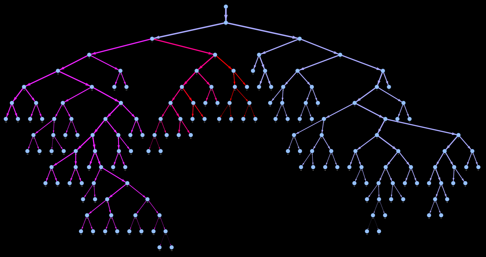

## CLI Commands

**Input Format**: Patient IDs are auto-padded to 4 digits and resolved to `data/graphs/{id}_any_pattern.json`.

### ▶️ `eval-mastora`

Score details in [formulas.md](scores/formulas.md#mastora-score).

| **Description** | Compute Mastora score for pulmonary embolism risk assessment.                                                                                                                                                                                                          |
| --------------- | ---------------------------------------------------------------------------------------------------------------------------------------------------------------------------------------------------------------------------------------------------------------------- |
| **Usage**       | `eval-mastora INPUT_FILE [OPTIONS]`                                                                                                                                                                                                                                    |
| **Input**       | JSON graph or patient ID (e.g. `0055`)                                                                                                                                                                                                                                 |
| **Options**     | `--use-percentage, -p` : treat degrees as percentages (0–1) `--mode, -m TEXT` : artery levels (‘m’, ‘l’, ‘s’), default: `mls` `--obstruction-attr, -o TEXT` : edge attribute, default: `transversal_obstruction_max` `--debug, -d` : show debug visualization |
| **Examples**    | `eval-mastora 55` `eval-mastora 0055 -p -m ml` `eval-mastora 0055 -d`                                                                                                                                                                                            |

### ▶️ `eval-qanadli`

Score details in [formulas.md](scores/formulas.md#qanadli-score).

| **Description** | Compute Qanadli score for pulmonary embolism risk assessment.                                                                                                                                                                       |
| --------------- | ----------------------------------------------------------------------------------------------------------------------------------------------------------------------------------------------------------------------------------- |
| **Usage**       | `eval-qanadli INPUT_FILE [OPTIONS]`                                                                                                                                                                                                 |
| **Input**       | JSON graph or patient ID (e.g. `0055`)                                                                                                                                                                                              |
| **Options**     | `--min-obstruction-thresh, -n FLOAT` : default `0.25` `--max-obstruction-thresh, -x FLOAT` : default `0.75` `--obstruction-attr, -o TEXT` : default `transversal_obstruction_max` `--debug, -d` : show debug visualization |
| **Examples**    | `eval-qanadli 55` `eval-qanadli 0055 -n 0.3 -x 0.8` `eval-qanadli 0055 -d`                                                                                                                                                    |

### ▶️ `visualize`

| **Description** | Interactive PyVis network visualization of obstruction values.              |
| --------------- | --------------------------------------------------------------------------- |
| **Usage**       | `eval-visualize INPUT_FILE [OPTIONS]`                                       |
| **Input**       | JSON graph or patient ID (e.g. `0055`)                                      |
| **Options**     | `--obstruction-attr, -o TEXT` : default `transversal_obstruction_max`       |
| **Examples**    | `eval-visualize 0055` `eval-visualize 55 -o transversal_obstruction_max` |

### ▶️ `correlate`

| **Description** | Correlate computed scores with clinical attributes and plot.                                                                                                                                                                                                                                                                                                                     |
| --------------- | -------------------------------------------------------------------------------------------------------------------------------------------------------------------------------------------------------------------------------------------------------------------------------------------------------------------------------------------------------------------------------- |
| **Usage**       | `eval-correlate SCORE_NAME ATTRIBUTE_NAME [OPTIONS]`                                                                                                                                                                                                                                                                                                                             |
| **Arguments**   | `SCORE_NAME` : `mastora` or `qanadli` `ATTRIBUTE_NAME` : `bnp`, `troponin`, `risk`, `spesi`                                                                                                                                                                                                                                                                                   |
| **Options**     | `--clinical-data, -c TEXT` : path to clinical CSV, default `data/PERSEVERE/clinical_data.csv` `--graphs-dirs, -g TEXT ...` : directories to search, default `data/PERSEVERE/raw` `--obstruction-attr, -o TEXT` : default `transversal_obstruction_max` `--all-attributes, -a` : include all obstruction attributes `--show-visualization, -v` : open plot in browser |
| **Examples**    | `eval-correlate mastora bnp -v` `eval-correlate qanadli troponin -c custom/data.csv` `eval-correlate mastora risk -g alt/graphs -o max_ancestors_obstruction`                                                                                                                                                                                                              |

&#160;

### List of obstruction attributes (`--obstruction-attr`)

| **Attribute**                     | **Description**                                                                               |
| --------------------------------- | --------------------------------------------------------------------------------------------- |
| `transversal_obstruction_max`     | Maximum transversal obstruction (mto) value across one edge of the graph, i.e. a blood vessel |
| `max_ancestors_obstruction`       | For an edge: `max(parent_mto, own_mto)`                                                       |
| `cumulated_ancestors_obstruction` | For an edge: `1 - (1 - parent_mto) * (1 - own_mto)`                                           |

### Visualization Examples

  <table width="100%">
    <tr>
      <td width="50%" align="center"><b><code>visualize 55 -o transversal_obstruction_max</code></b></td>
      <td width="50%" align="center"><b><code>visualize 55 -o max_ancestors_obstruction</code></b></td>
    </tr>
    <tr>
      <td width="50%" align="center"></td>
      <td width="50%" align="center"></td>
    </tr>
  </table>

